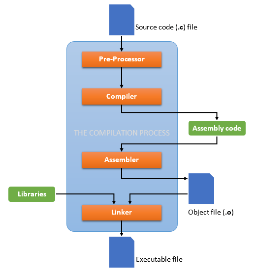
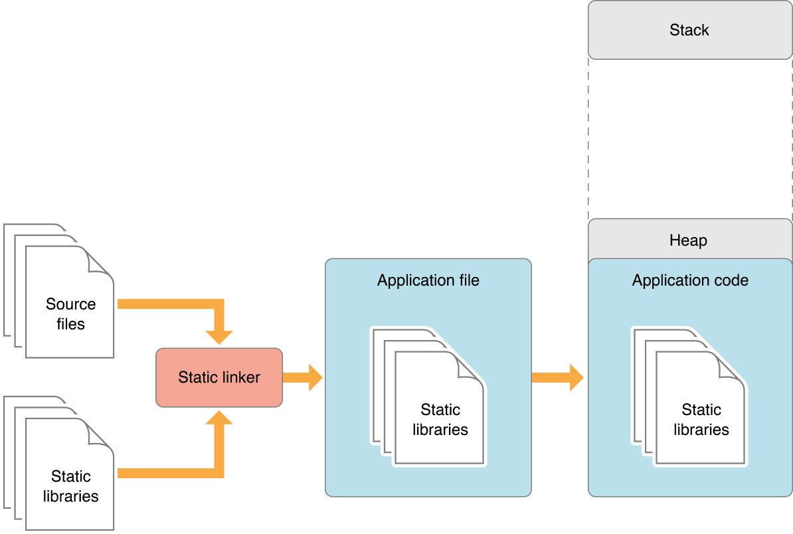

# Build Workflow

- [Build Workflow](#build-workflow)
  - [**C/C++ Build Stages**](#cc-build-stages)
    - [**Preprocessing**](#preprocessing)
    - [**Compilation**](#compilation)
    - [**Linking**](#linking)
    - [**Steps**](#steps)
  - [**Libraries**](#libraries)
    - [**Static Libraries**](#static-libraries)
    - [**Shared Libraries**](#shared-libraries)
    - [**Create Shared library from Static**](#create-shared-library-from-static)

## **C/C++ Build Stages**

The compilation of a C++ program involves three steps:

1. Preprocessing: the preprocessor takes a C++ source code file and deals with the #includes, #defines and other preprocessor directives. The output of this step is a "pure" C++ file without pre-processor directives.

2. Compilation: the compiler takes the pre-processor's output and produces an object file from it.

3. Linking: the linker takes the object files produced by the compiler and produces either a library or an executable file.

### **Preprocessing**

The preprocessor handles the preprocessor directives, like #include and #define. It is agnostic of the syntax of C++, which is why it must be used with care.

It works on one C++ source file at a time by replacing #include directives with the content of the respective files (which is usually just declarations), doing replacement of macros (#define), and selecting different portions of text depending of #if, #ifdef and #ifndef directives.

The preprocessor works on a stream of preprocessing tokens. Macro substitution is defined as replacing tokens with other tokens (the operator ## enables merging two tokens when it makes sense).

After all this, the preprocessor produces a single output that is a stream of tokens resulting from the transformations described above. It also adds some special markers that tell the compiler where each line came from so that it can use those to produce sensible error messages.

Some errors can be produced at this stage with clever use of the #if and #error directives.

### **Compilation**

The compilation step is performed on each output of the preprocessor. The compiler parses the pure C++ source code (now without any preprocessor directives) and converts it into assembly code. Then invokes underlying back-end(assembler in toolchain) that assembles that code into machine code producing actual binary file in some format(ELF, COFF, a.out, ...). This object file contains the compiled code (in binary form) of the symbols defined in the input. Symbols in object files are referred to by name.

Object files can refer to symbols that are not defined. This is the case when you use a declaration, and don't provide a definition for it. The compiler doesn't mind this, and will happily produce the object file as long as the source code is well-formed.

Compilers usually let you stop compilation at this point. This is very useful because with it you can compile each source code file separately. The advantage this provides is that you don't need to recompile everything if you only change a single file.

The produced object files can be put in special archives called static libraries, for easier reusing later on.

It's at this stage that "regular" compiler errors, like syntax errors or failed overload resolution errors, are reported.

### **Linking**

The linker is what produces the final compilation output from the object files the compiler produced. This output can be either a shared (or dynamic) library (and while the name is similar, they haven't got much in common with static libraries mentioned earlier) or an executable.

It links all the object files by replacing the references to undefined symbols with the correct addresses. Each of these symbols can be defined in other object files or in libraries. If they are defined in libraries other than the standard library, you need to tell the linker about them. Note that for static libraries, the actual library is placed in your final program, while for shared libraries, only a reference to the library is placed inside.

At this stage the most common errors are missing definitions or duplicate definitions. The former means that either the definitions don't exist (i.e. they are not written), or that the object files or libraries where they reside were not given to the linker. The latter is obvious: the same symbol was defined in two different object files or libraries.

### **Steps**

GCC compiles a C/C++ program into executable in 4 steps. For example, `gcc hello.c -o hello` is carried out as follows:

1. Preprocessing via the GNU C Preprocessor (cpp.exe), which includes the headers (#include) and expands the macros (#define).

        cpp hello.c > hello.i

    The resultant intermediate file "hello.i" contains the expanded source code.

2. The compiler compiles the pre-processed source code into assembly code for a specific processor.

        gcc -S hello.i

    The -S option specifies to produce assembly code, instead of object code. The resultant assembly file is "hello.s".

3. The assembler (as.exe) converts the assembly code into machine code in the object file "hello.o".

        as -o hello.o hello.s

4. Linker

    Finally, the linker (ld.exe) links the object code with the library code to produce an executable file "hello".

        ld -o hello hello.o ...libraries...

In 2 steps, we can write

    gcc -c hello.c
    gcc hello.o -o hello

## **Libraries**

Libraries are an indispensable tool for any programmer. They are pre-existing code that is compiled and ready for you to use. They often provide generic functionality, like linked lists or binary trees that can hold any data, or specific functionality like an interface to a database server such as MySQL.

Most larger software projects will contain several components, some of which you may find use for later on in some other project, or that you just want to separate out for organizational purposes. When you have a reusable or logically distinct set of functions, it is helpful to build a library from it so that you do not have to copy the source code into your current project and recompile it all the time - and so you can keep different modules of your program disjoint and change one without affecting others. Once it is been written and tested, you can safely reuse it over and over again, saving the time and hassle of building it into your project every time.

### **Static Libraries**

**Static** libraries are .a (or in Windows .lib) files. All the code relating to the library is in this file, and it is directly linked into the program at compile time. A program using a static library takes copies of the code that it uses from the static library and makes it part of the program. [Windows also has .lib files which are used to reference .dll files, but they act the same way as the first one].

Static libraries can be built by using the GNU programs *gcc* and *ar*. Members of a static library are the object files that a developer wrote. Gcc can be used to create object files by compiling your source code, but stopping before the linking phase:

    gcc -c *.c

will create object files for all c files in the current directory. They will have the same basename by default, with the .o extension.

Now that you have object files, you can create a library with the following command:

    ar -rcs libsample.a *.o

r automatically replaces any object files with the same name, c creates a new archive, and s indexes the archive. libsample.a is the name of the library, and *.o tells ar to include all files that end in .o in the current directory.

To compile a program and statically link it in with a library (like libsample.a) you can use gcc again.

    gcc my_program.c -L. -lsample -o my_program

Let’s break that down:

- -L specifies the directory for library files. The
    "." represents the current working directory
- -l specifes linking with a library file with name
    *sample*. Note that we omitted the “lib” prefix and “.a” extension. The linker attaches these parts back to the name of the library to create a name of a file to look for.
- -o specifies the name of the executable file

The final product is an executable file called my_program that has been statically linked with library. This executable will have everything it needs to function. If changes need to be made to any functions, variables or classes in the library, you will need to recompile the entire application.

### **Shared Libraries**

**Shared** libraries are .so (or in Windows .dll, or in OS X .dylib) files. All the code relating to the library is in this file, and it is referenced by programs using it at run-time. Run-time refers to the time when the application is running. Applications that use shared libraries are linked dynamically. This means that none of the shared library’s code is linked into the application; only the address in memory of where the library code resides is linked in.

- To compile source files for a shared library we use

        gcc -c -fPIC *.c

    -c creates the object files with .o extension

    -fPIC makes the object files position independent. Shared libraries can be loaded in memory at any address, so the object code must not rely on one particular location. Position Independent Code can be mapped to different memory addresses without needing to be changed.

- To create the shared library we use

        gcc -shared *.o -o libsample.so

    -shared creates a shared library so more than one application can use it.

- Once *libsample.so* is created it can be linked in with an application:

        gcc -L/some/path/name main.c -lsample -o main

    That command tells gcc to compile main.c into an executable called main using the shared library *libsample.so* that is located at /some/path/name in the file system. Note that the -lsample option is not looking for sample.o, but *libsample.so*. GCC assumes that all libraries start with lib and end with .so or .a

        export LD_LIBRARY_PATH=/some/path/name:$LD_LIBRARY_PATH

    will add the location of the shared library to the path, allowing loader to locate the shared library.

If you ever want to see which shared libraries are used in an *ELF* you can used the `ldd` command. `ldd my_program` will show all the shared object files used, along with the address in the application’s memory they have been mapped to. The `nm` command displays symbol names of the “books” (functions, variables, classes, etc) in libraries. So if you wanted to go deeper and see which the names of functions in a shared library you can use

    nm -D /lib/x86_64-linux-gnu/libc-2.23.so

for example.

### **Create Shared library from Static**

Suppose that we have a static library *libfiles.a* that contains object files that were produced with -fPIC argument. We can create a shared library that contains the static one and an object file *file3.o* using

    gcc -Wl,--whole-archive libfiles.a -Wl,--no-whole-archive -shared file3.o -o libfiledyn.so

The -Wl options to gcc are directly passed to the linker (gcc invokes the linker “ld” as the last step before creation of an executable or a shared library). The linker gets the option “–whole-archive” - this option instructs the linker to “extract” the option argument (in this case, libfiles.a) so that all the object files in the archive (file1.o and file2.o) are individually added to the link command line (equivalent to actually having them on the command line separately); the –no-whole-archive reverses this behaviour. Both –whole-archive and –no-whole-archive are needed because the linker extracts all the archives that are present in-between these options.
